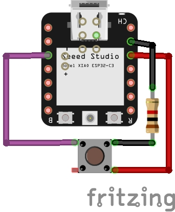
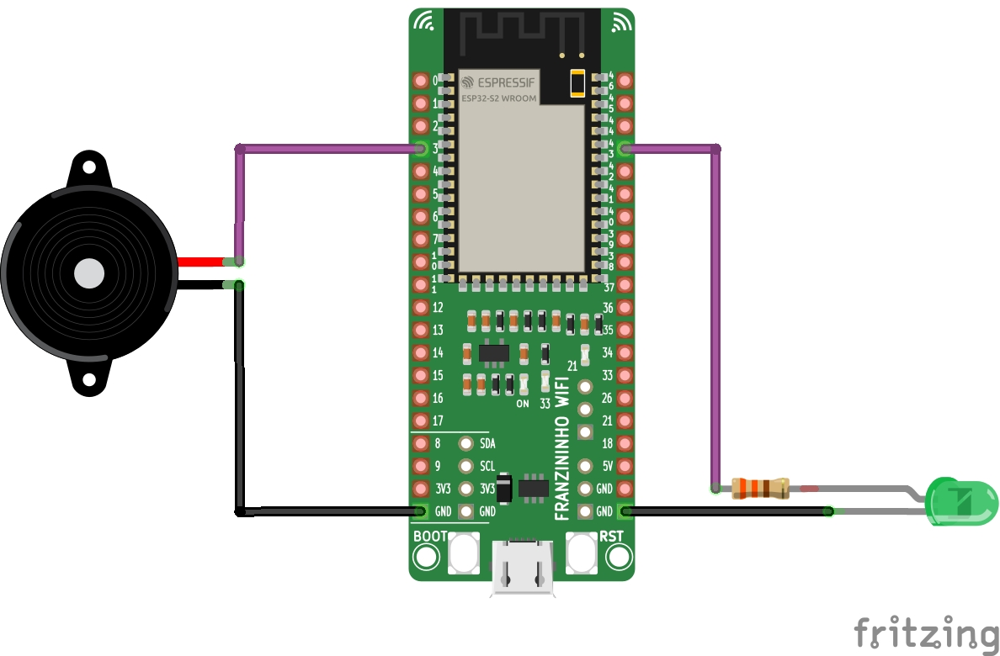

# LeRaWan
Botão de pânico para idosos 

## O que compõe o projeto?
O projeto é composto por pelo menos dois microcontroladores ESP, um atuando como emissor e outro atuando como receptor. A ideia do projeto é que ao apertar o botão do microcontrolador utilizado como emissor, um sinal seja enviado ao receptor utilizando o protocolo [ESP-NOW](https://www.espressif.com/en/solutions/low-power-solutions/esp-now).

Também é possível adicionar um terceiro ESP com a função de "repetidor" de sinal entre o emissor e o receptor, aumentando assim o raio de atuação do projeto. O projeto foi desenvolvido utilizando a IDE e o framework de programação do Arduino.

## Placas utilizadas:
O código do emissor foi desenvolvido tendo em mente a placa [Seeed Studio XIAO ESP32C3](https://wiki.seeedstudio.com/XIAO_ESP32C3_Getting_Started/) enquanto o código do receptor e do repetidor foram desenvolvidos para a placa [Franzininho Wifi](https://docs.franzininho.com.br/docs/franzininho-wifi/franzininho-wifi/).

Dentro do repositório também é possível encontrar versões alternativas do código do emissor para o ESP8266 e o M5StickC.

## Conteúdos das pastas:
 - [Emissor](./Emissor/) - código do emissor para a placa XIAO
 - [Receptor](./Receptor/) - código do receptor para a placa Fraznininho Wifi
 - [Repetidor](./Repetidor/) - código do repetidor para a placa Franzininho Wifi
 - [Emissores Alternativos](./EmissoresAlternativos/) - código do emissor para as placas ESP8266 M5StickC.
 - [lerawan_comum](./lerawan_comum/) - biblioteca com códigos comuns ao emissor, receptor e repetidor

## Como utilizar o projeto
Para utilizar o projeto é preciso fazer o upload dos códigos do receptor e do emissor para suas respectivas placas. Os códigos do emissor, receptor e repetidor necessitam da biblioteca [lerawan_comum](./lerawan_comum/) que se encontra na pasta de mesmo nome nesse repositório. 

Nesta biblioteca, é preciso fazer a definição dos endereços mac das placas que representam o emissor, o receptor e o repetidor, se esse for usado. Além disso, na biblioteca também é definido o canal Wifi onde a comunicação acontecerá e a struct que será usada para a transmissão de dados. A biblioteca também contém uma função que pode ser usada para imprimir o mac da placa no monitor serial caso você não tenha essa informação. O endereço mac precisa ser colocado no arquivo no formato hexadecimal.

Depois de atualizar os dados presentes na biblioteca com os dados referente ao seu ambiente local, você deve adicionar a pasta lerawan_comum como uma biblioteca através da IDE do Arduino. 

## Montagem dos Circuitos
Circuitos para a montagem do emissor e do receptor. Para a placa que atua como repetidor de sinal, não é necessário nenhum tipo de circuito.

**Emissor**

*Obs: É preciso conectar também uma bateria de 3.7V nos pads de bateria que se encontram no bottom da placa*

**Receptor**

